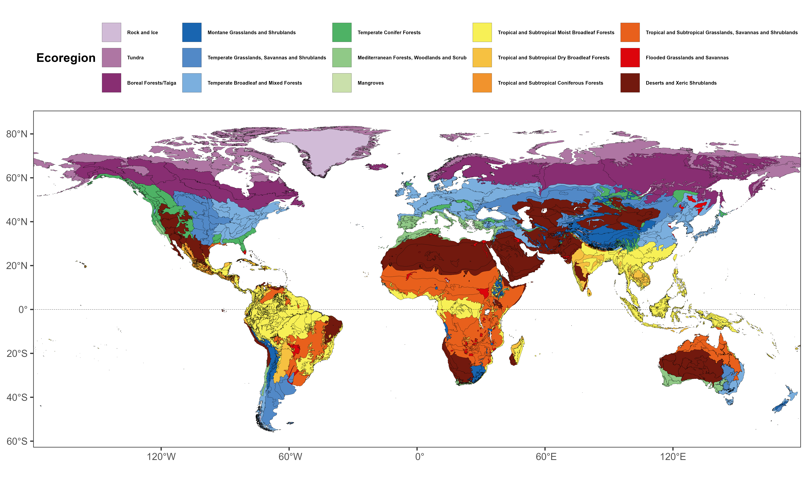
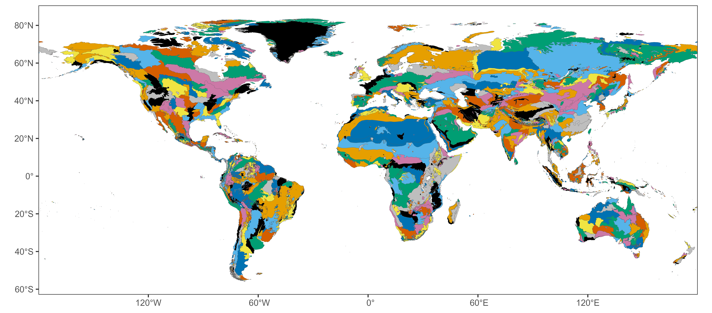
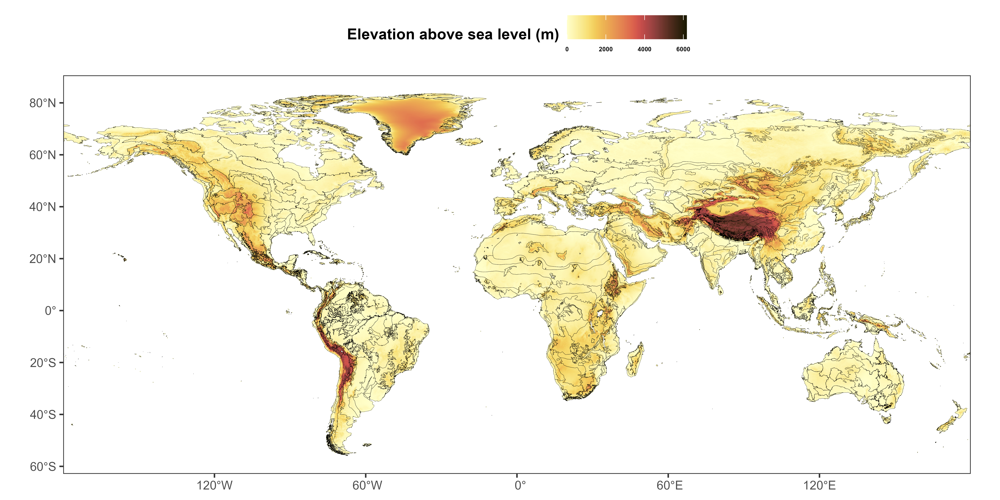
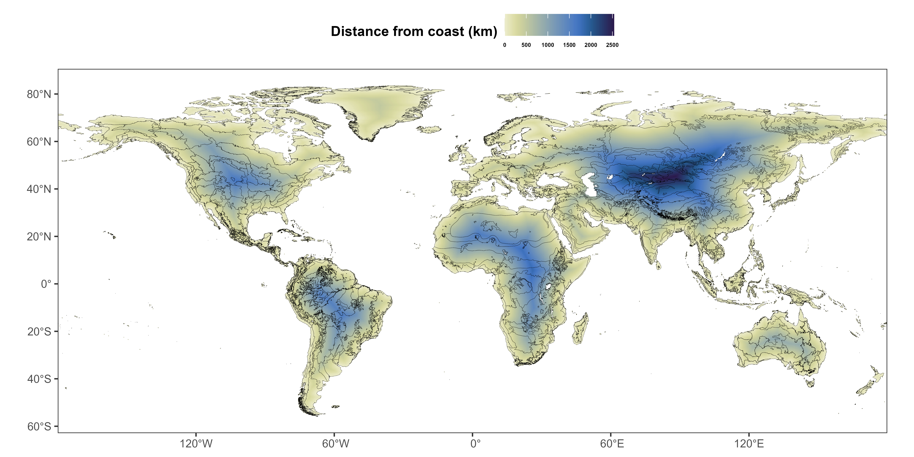
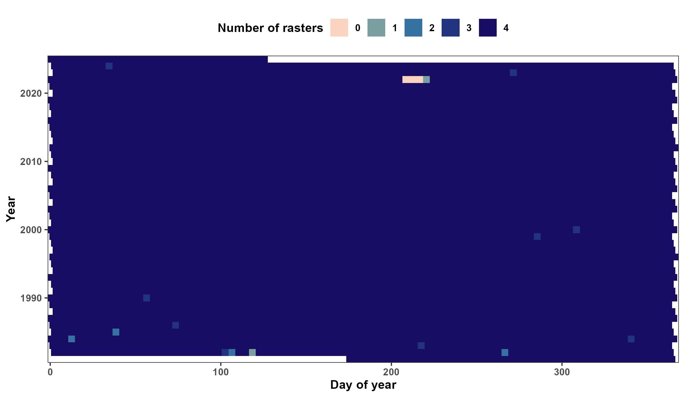

\clearpage

```{r setup, include=FALSE}
knitr::opts_chunk$set(echo = FALSE, out.width = '100%', fig.align = 'center')
```

```{r packages, warning=FALSE}
library('knitr')
```

\noindent The figures below illustrate some of the data used for fitting the models. All color palettes below are available via the `khroma` package [@frerebeau_khroma_2024] for `R` [@r_core_team_r_2024]. The code for generating the figures is available [on GitHub](https://github.com/QuantitativeEcologyLab/ndvi-stochasticity/blob/main/analysis/figures/input-data.R). The figure below illustrates each color palette for each type of vision (trichromatic, deuteranope, protanope, tritanope, and achomatic). Palette A is commonly attributed to Masataka Okabe and Kei Ito [@ichihara_color_2008], while the other palettes were created by Fabio Crameri [@crameri_geodynamic_2018; @crameri_scientific_2018].

```{r color-palettes, fig.cap="Color palettes used in the figures below."}
include_graphics('../figures/input-data/color-palettes.png')
```

```{r ecoregions, fig.cap="Map of the ecoregions."}

```

```{r polygons, fig.cap="Map of the polygons for each ecoregion. Each polygon is colored randomly with one of the 9 colors. Note that some neighboring polygons have the same color."}

```

```{r elevation, fig.cap="Map of elevation above sea level."}

```

```{r distance-coast, fig.cap="Map of the estimated distance from the nearest coastal edge.", eval=FALSE}

```

```{r n-rasters, fig.cap="Number of days with a raster within 15-day periods starting on January $1^{\\text{st}}$, for each year."}

```

\clearpage

# References
