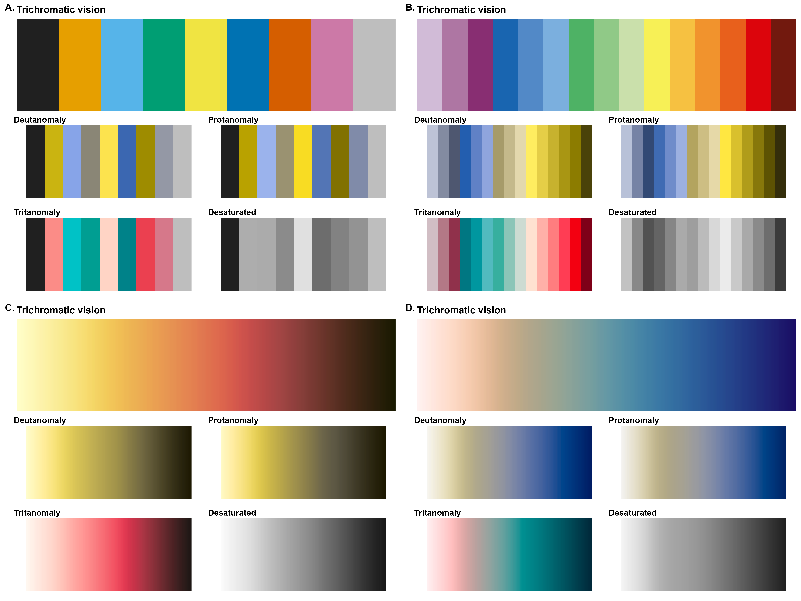
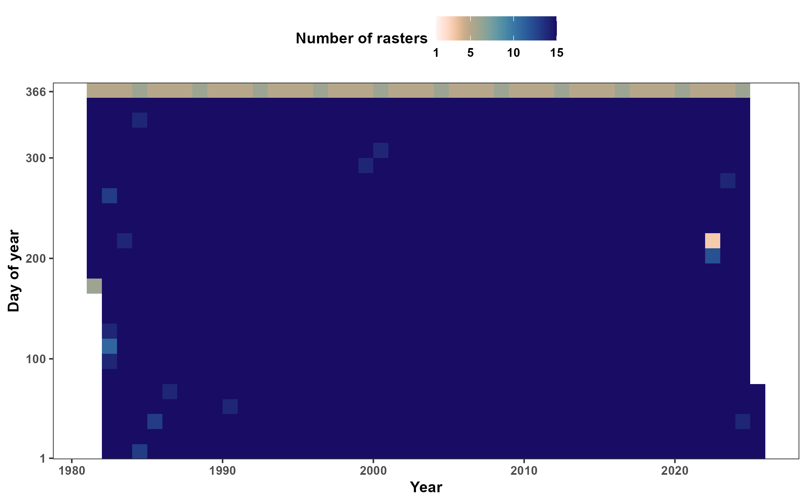
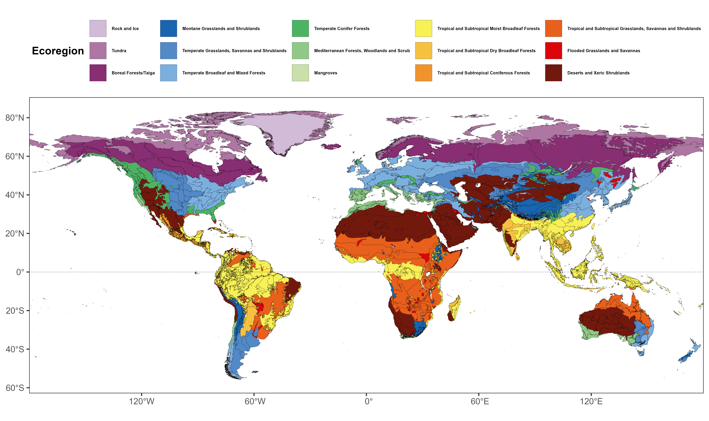
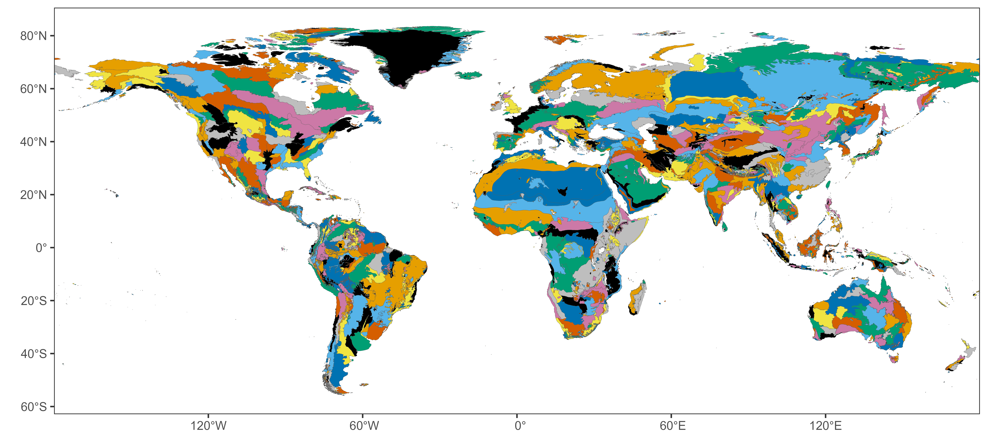
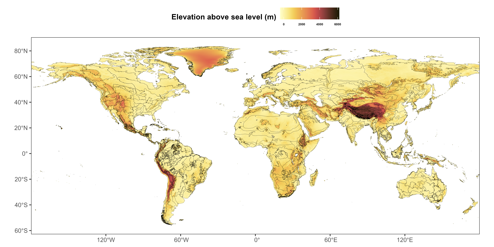
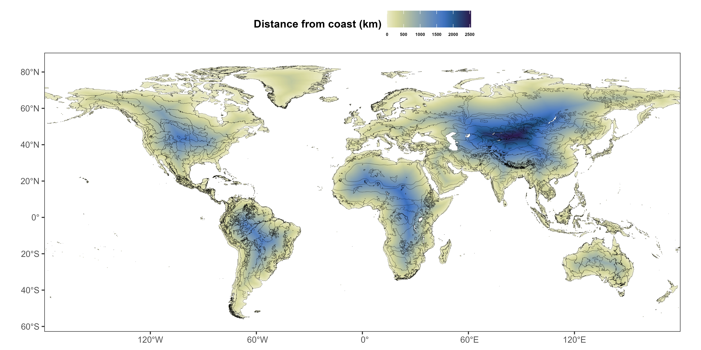

\clearpage

```{r setup, include=FALSE}
knitr::opts_chunk$set(echo = FALSE, out.width = '100%', fig.align = 'center')
```

```{r packages, warning=FALSE}
library('knitr')
```

\noindent Figure A1 below illustrates the color palettes used in this appendix, for each type of vision (trichromatic, deuteranope, protanope, tritanope, and achomatic). Palette A4 was created by Masataka Okabe and Kei Ito [@okabe_color_2008], while the other palettes were created by Fabio Crameri [@crameri_geodynamic_2018; @crameri_scientific_2018]. All palettes below are available via the `khroma` package [@frerebeau_khroma_2024] for `R` [@r_core_team_r_2024]. Figures A2-A5 show some of the data used for fitting the models for estimating mean NDVI and the variance around the mean. The code for generating the figures is available on GitHub at [https://github.com/QuantitativeEcologyLab/ndvi-stochasticity/blob/main/analysis/figures/input-data.R](https://github.com/QuantitativeEcologyLab/ndvi-stochasticity/blob/main/analysis/figures/input-data.R).

```{r color-palettes, fig.cap="Color palettes used in the figures below."}

```

```{r n-rasters, fig.cap="Number of days with a raster within 15-day periods starting on January $1^{\\text{st}}$, for each year. Cells with less than 15 rasters indicate one or more missing rasters for that 15-day period, which the exception of cells near day 366, which have 6 days during leap years ($366 \\mod 15 = 6$) and 5 days otherwise ($365 \\mod 15 = 5$)."}

```

```{r ecoregions, fig.cap="Map of the ecoregions. The Northern and Southern hemispheres were coded to have separate ecoregions in the model by appending \"N\" or \"S\" to the end of the ecoregion name."}

```

```{r polygons, fig.cap="Map of the polygons for each ecoregion. Each polygon is colored randomly with one of 9 colors. Note that some neighboring polygons have the same color."}

```

```{r elevation, fig.cap="Map of elevation above sea level. All elevations below 0 m were set to 0 m to fix incorrect altitudes near coast lines. Terrestrial ecosystems with elevations below 0 m (such as the Dead Sea and the Qattara Depression) have also been set to 0 m because they have their own polygons, which allows to account for any differences in the Markov Random Field smooth."}

```

```{r distance-coast, fig.cap="Map of the estimated distance from the nearest coastal edge.", eval=FALSE}
# not evaluated!

```

\clearpage

# References
