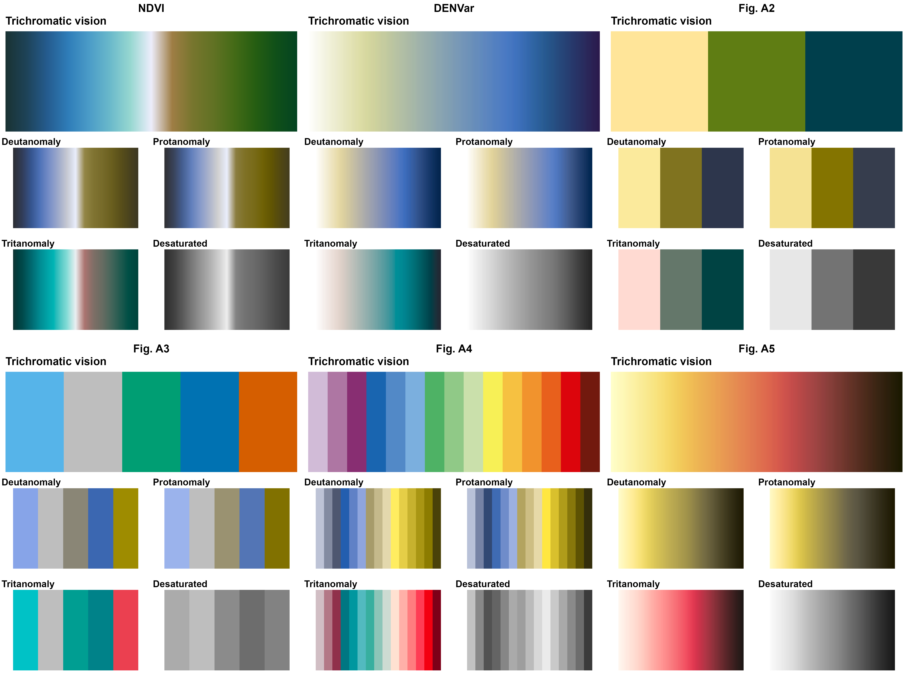
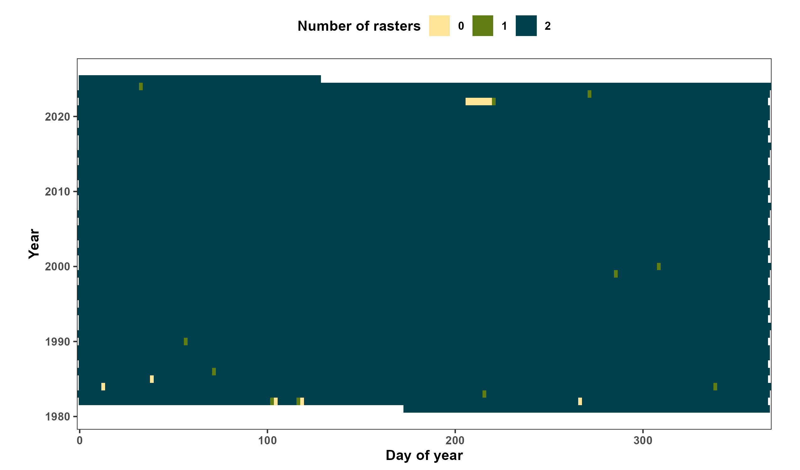

\clearpage

```{r setup, include=FALSE}
knitr::opts_chunk$set(echo = FALSE, out.width = '100%', fig.align = 'center')
```

```{r packages, warning=FALSE}
library('knitr')
```

\noindent Figure A1 below illustrates the color palettes used in the main manuscript and this appendix, for each type of vision (trichromatic, deuteranope, protanope, tritanope, and achomatic). The NDVI palette is a modified version of the Bukavu palette by Fabio Crameri [@crameri_geodynamic_2018; @crameri_scientific_2018]. Palette A3 is a modified version of a pallette by Masataka Okabe and Kei Ito [@okabe_color_2008]. All other palettes were created by Fabio Crameri [@crameri_geodynamic_2018; @crameri_scientific_2018]. All original palettes are available via the `khroma` package [@frerebeau_khroma_2024] for `R` [@r_core_team_r_2024]. Figures A2-A5 show some of the data used for fitting the models for estimating mean NDVI and the variance around the mean. The code for generating the figures is available on GitHub at [https://github.com/QuantitativeEcologyLab/ndvi-stochasticity/blob/main/analysis/figures/input-data.R](https://github.com/QuantitativeEcologyLab/ndvi-stochasticity/blob/main/analysis/figures/input-data.R).

```{r color-palettes, fig.cap="Color palettes used in the main manuscript and the figures below."}

```

```{r n-rasters, fig.cap="Number of days with a raster within each 2-day period. used for temporal aggregation of the data."}

```

```{r data-groups, fig.cap="To avoid data size limitations in $\\texttt{R}$, data were split into groups of WFF realms. Also see Fig. A4 below."}
include_graphics('../figures/input-data/data-groups.png')
```

```{r biomes, fig.cap="Map of WWF biomes. Also see Fig. A3 above."}
include_graphics('../figures/input-data/biomes.png')
```

```{r elevation, fig.cap="Map of elevation above sea level. All elevations below the lowest altitude in the Dead Sea (-432 m) were set to -432 m to remove excessively negative altitudes near coast lines. The $\\texttt{elevatr}$ package for $\\texttt{R}$ did not provide elevations for the southernmost region of Antarctica."}
include_graphics('../figures/input-data/elev-m.png')
```

\clearpage

# References
