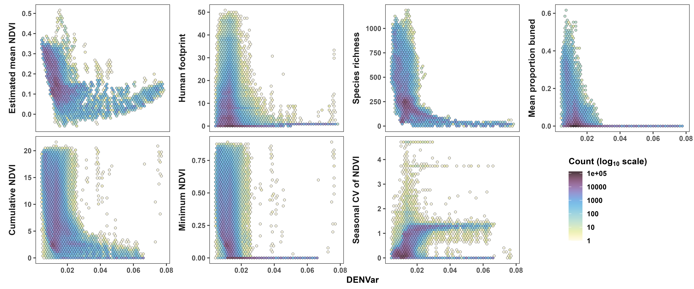

```{r, echo=FALSE}
# need to write abstract before cover page to state number of words in it
abstract <- "Remote-sensing estimates of habitat productivity such as the Normalized Differnece Vegetation Index (NDVI) have helped develop and support a variety of hypotheses and inform policy and industriy-related decisions. The free availability of such data has allowed widespread access and use of well-established metrics of habitat productivity. However, historically, users tended to focus solely on (predictable) trends in productivity. In recent years, people have been recognizing the importance of envrironmental unpredictability (stochasticity), particularly as climate change and human-induced rapid environmental change transform the ecosystems species have evolved in and adapted to. We adress this gap by presenting a new global Dynamic Estimate of NDVI Variance, *DENVar*. We estimate spatiotemporal trends in mean NDVI and the variance around the mean using Hierarchical Generalized Additive Models, which provide a flexible yet transparent and interpretable model structure. We show that DENVar can be used as a reliable proxy of environmental stochasticity, strongly correlates with ***XXX***, and can be used to test many hepotheses related to environmental stochasitcity, such as forage stochasticity, regime shifts, ... . We conclude by offering some considerations around quantifying and interpreting envirnomental stochasticity, and we provide a publicly and freely available shiny app for estimating mean NDVI and the variance around it, DENVar, for given coordinates and optional dates. The app requires no knowledge of statistics or coding. Additionally, we provide a temporally static raster of mean NDVI and DENVar for the years 1981-2025 that can be used for GIS applications and does not require any knowledge of $\\texttt{R}$."

if(FALSE) {
  stringi::stri_count_words(abstract)
}
```

<!-- elements of the title page -->

\clearpage

\noindent \textbf{Article type}: Research article

\noindent \textbf{Words in abstract}: `r stringi::stri_count_words(abstract)`

\noindent \textbf{Words in main text}: `r suppressMessages(wordcountaddin::word_count())`

\noindent \textbf{Figures}: \textcolor{red}{\textbf{XXX}}

\noindent \textbf{Tables}: \textcolor{red}{\textbf{XXX}}

\noindent \textbf{References}: \textcolor{red}{\textbf{XXX}}

\noindent \textbf{Appendices}: \textcolor{red}{\textbf{XXX}}

\noindent \textbf{Key words:} remote sensing, NDVI, environmental stochasticity, \textcolor{red}{\textbf{XXX}}

<!-- start main body on a new page -->

\newpage

\doublespacing

```{r setup, include=FALSE}
knitr::opts_chunk$set(echo = FALSE, out.width = '100%', fig.align = 'center', message = FALSE, warning = FALSE, comment = '#')

# set to TRUE if you want to test figures for color-deficient vision
TEST_CDV <- FALSE
```

\linenumbers

# Abstract

\noindent `r abstract`

\newpage

useful refs:

* https://www.sciencedirect.com/science/article/abs/pii/S0034425711001957?fr=RR-2&ref=pdf_download&rr=962beb22bcb58443
* https://www.nature.com/articles/s41467-025-61585-5
* AVHRR cloud detection using MODIS data:
* franch_30_2017
* villaescusa-nadal_modis-based_2022
* see `to-read` folder

stochasticity impacts a wide range of processes, from the individual scale [@mezzini_how_2025] to the ecosystem scales [@noonan_planning_2025]

submitting at journal of remote sensing? (https://spj.science.org/page/remotesensing/for-authors)

\newpage

# Introduction

<!-- remote sensing allows us to study landscapes in detail and over large spatiotemporal scales. Advantages and limitations of remote sensing (no field work, "free"; polluted signal, irregular res) -->

\noindent The Normalized Difference Vegetation Index (NDVI), an estimate of plant greenness and productivity, was first introduced by @rouse_monitoring_1974 and @rouse_monitoring_1974-1 using spectral data from the Landsat 1 satellite. NDVI allowed researchers to evaluate plant productivity and phenology using satellite data [@tucker_red_1979] or hand-held devices [@tucker_monitoring_1979] via a proxy of primary productivity, forage availability, and vegetative cover. Satellite measurements of NDVI thus allowed analysts to remotely monitor not only vegetation but also animals' responses to changes in forage availability [@rouse_monitoring_1974-1; @pettorelli_using_2005; @pettorelli_normalized_2011].

Since NDVI is not a direct measurement primary productivity but a proxy, it should be interpreted carefully [@pettorelli_normalized_2011]. NDVI is prone to loss of sensitivity in very green (i.e., highly saturated) environments [@matsushita_sensitivity_2007; @son_comparative_2014], and estimates vary across sensors [@beck_global_2011; @huang_commentary_2021; @huang_commentary_2021]. Results can depend on the sensor used to measure NDVI [@fan_global_2016], and the coarse scale of satellite-derived NDVI can be a substantial barrier when when assessing fine-scale changes, heterogeneity, or responses [@goodchild_scale_2023; @reid_its_2018; @nathan_big-data_2022]. Still, NDVI is often used because it is free, well-established, and available at a wide variety of spatiotemporal scales [@tarnavsky_multiscale_2008] while also requiring minimal work to acquire.

<!-- Uses and history of ndvi [successes of NDVI: pettorelli, Aikens]. -->

NDVI has proven particularly useful in a multitude of fields, including animal movement behavior [@merkle_large_2016; @geremia_migrating_2019], landscape fragmentation [@mallegowda_assessing_2015], phenology [@hmimina_evaluation_2013], habitat classification [@clerici_exploring_2012], and forest recovery after fires [@joao_indicator-based_2018]. Historically, analysts focused on changes in mean NDVI, but recent work has included other metrics of NDVI, including rates of change [@aikens_greenscape_2017] and changes in variance [i.e., variation around the mean, stochasticity$;$ @zhang_ndvi_2009; @mutti_ndvi_2020; @mezzini_how_2025]. However, estimating trends in NDVI variance presents some additional challenges, particularly when environments are dynamic and (spatio)temporally heterogeneous.

<!-- requirements for good estimates of variance: comments on scale and smoothness -->

Fig. \@ref(fig:fig-smooth-wiggly)) illustrates some of the difficulties that arise in modeling trends in variance in NDVI. Disentangling signal from noise is a central aspect of estimating trends in NDVI variance, but what constitutes as signal is dependent on the observer's scale of perception [@levin_problem_1992; @steixner-kumar_strategies_2020]. A forest fire may be extremely disruptive to a small animal with limited motility and a small range size, while a bird or a large mammal may not struggle to survive after relocating or altering its movement behavior [@nathan_movement_2008; @riotte-lambert_environmental_2020]. Similarly, what may be a severe drought to an annual plant may be no more than an unusually dry year for a plant with a longer generation timescale [@frankham_importance_2004]. Thus, disentangling trends in mean NDVI from changes in NDVI variance requires a conscious decision about the scale at which to consider the data.

<!-- Introduce the study -->

In this article, we present the Dynamic Estimate of NDVI Variance (DENVar). We estimate DENVar using 44 years of NDVI data from the AVHRR and VIIRS collection of sensors and Generalized Additive Models (GAMs). Although satellites with AVHRR and VIIRS sensors provide data at a coarser resolution (0.05$^\circ$) than other satellites (e.g., 250m for MODIS), they are the only sensors to provide data at a daily frequency and and for more than 40 years. Generalized Additive Models provide a flexible yet interpretable approach for estimating trends in mean and variance in NDVI without the rigidity of other more traditional methods (e.g., ARIMA) or the opaqueness of machine learning models such as neural networks [@simpson_modelling_2018; @wood_generalized_2017]. We illustrate the relationships between DENVar and relevant ecological metrics, and we provide analysts with three options for incorporating DENVar in their own analyses without requiring any knowledge of `R`: (1) rasters of long-term averages from 1981 to 2025, rasters of yearly averages from 1982 to 2024, and a simple Shiny app that provides estimates for specific locations and dates.

```{r fig-smooth-wiggly, cache=TRUE, fig.cap="\\textbf{Estimates of variance in NDVI depend on the estimated trends in mean NDVI.} Black lines indicate the estimated mean and variance in simulated NDVI (points). Grey ribbons correspond to 95% credible intervals, while the colored segments highlight significant increases (red) and decreases (blue).\\\\ Smoother estimates of the mean (top left) result in wigglier and larger variance estimates (bottom left), since short-term trends in the data are considered to be stochastic events. In contrast, wigglier estimates of the mean (top right) result in smoother and smaller variance estimates (bottom right), since short-term trends in the data are attributed to changes in the mean. The data in the top row is the same in both columns. It was generated as the sum of a sinusoidal function and a mean-reverting, correlated, stochastic process with mean zero. ***ADD METHODS OR REFERENCE APPENDIX***", fig.width=9, fig.height=6}
library('dplyr')   # for data wrangling
library('tidyr')   # for data wrangling
library('mgcv')    # for modeling
library('gratia')  # for working with GAMs
library('ggplot2') # for plotting
source('../analysis/figures/000-default-ggplot-theme.R')

# OU process given samples times, reversion time, standard deviation 
ou <- function(t, theta, sigma){
  n <- length(t) # number of samples
  dw  <- rnorm(n = n, mean = 0, sd = sqrt(sigma)) # noise between steps
  
  x <- numeric(n)
  x[1] <- 0 # set starting point
  for (i in 2:n) {
    x[i] <- (1 - theta) * x[i-1] + dw[i - 1]
  }
  return(x)
}

set.seed(3)
d <- tibble(t = seq(0, 1, length.out = 500),
            mu = (sinpi(sqrt(t + 0.5) * 10 - 0.5) * 3 + 1 * sqrt(t)) / 50 + 0.3,
            s2 = cospi(sqrt(t) - 0.5) * 0.001^2,
            noise = ou(t = t, theta = 0.2, sigma = sqrt(s2)),
            y = mu + noise)

if(FALSE) {
  ggplot(d) +
    geom_line(aes(t, mu), color = 'red') +
    geom_line(aes(t, y), alpha = 0.5)
}

m_wiggly <- gam(list(y ~ s(t, k = 30, bs = 'ad'), ~ s(t)),
                family = gaulss(), data = d, method = 'REML')
m_smooth <- gam(list(y ~ s(t, k = 10), ~ s(t)),
                family = gaulss(), data = d, method = 'REML')

get_preds <- function(model, model_name) {
  d0 <- tibble(t = seq(0, 1, by = 1e-3))
  
  inv_link_l <- inv_link(model, parameter = 'location')
  inv_link_s <- inv_link(model, parameter = 'scale')
  
  bind_cols(
    d0,
    predict(model, newdata = d0, type = 'link', se.fit = TRUE) %>%
      as.data.frame() %>%
      transmute(Mean_est = inv_link_l(fit.1),
                Mean_lwr = inv_link_l(fit.1 - 1.96 * se.fit.1),
                Mean_upr = inv_link_l(fit.1 + 1.96 * se.fit.1),
                Variance_est = 1 / inv_link_s(fit.2)^2, # (SD)^2
                Variance_lwr = 1 / inv_link_s(fit.2 - 1.96 * se.fit.2)^2,
                Variance_upr = 1 / inv_link_s(fit.2 + 1.96 * se.fit.2)^2,
                model = model_name)) %>%
    pivot_longer(-c(t, model), names_sep = '_',
                 names_to = c('parameter', 'measure')) %>%
    mutate(parameter = if_else(parameter == 'Mean', 'Mean NDVI',
                               'Variance in NDVI')) %>%
    pivot_wider(names_from = 'measure', values_from = 'value') %>%
    arrange(parameter, t) %>% # so mean and var match with s(t) and s.1(t)
    bind_cols(.,
              derivatives(model, select = c('s(t)', 's.1(t)'), data = d0) %>%
                transmute(smooth = .smooth,
                          deriv = .derivative,
                          deriv_lwr = .lower_ci,
                          deriv_upr = .upper_ci,
                          trend = case_when(deriv_lwr > 0 ~ 'increase',
                                            deriv_upr < 0 ~ 'decrease')))
}

preds <-
  bind_rows(get_preds(m_wiggly, 'Wiggly'), get_preds(m_smooth, 'Smooth')) %>%
  mutate(model = paste(model, 'mean'),
         # to keep highlights distinct between changes in direction
         g = c(0, cumsum(trend[1:(n()-1)] != trend[2:n()])))

resids <- bind_rows(
  mutate(d,
         model = 'Smooth mean',
         e = residuals(m_smooth, type = 'response')),
  mutate(d,
         model = 'Wiggly mean',
         e = residuals(m_wiggly, type = 'response'))) %>%
  mutate(parameter = 'Variance in NDVI')

fig_1 <-
  ggplot(preds) +
  facet_grid(parameter ~ model, scales = 'free', switch = 'y', ) +
  # data and squared residuals
  geom_point(aes(t, y), mutate(d, parameter = 'Mean NDVI'), alpha = 0.2) +
  geom_point(aes(t, e^2), resids, alpha = 0.2) +
  # estimated trends
  geom_ribbon(aes(t, ymin = lwr, ymax = upr), alpha = 0.2) +
  geom_line(aes(t, est, color = trend, group = g), linewidth = 2.5,
            alpha = 0.8, show.legend = FALSE, na.rm = TRUE) +
  geom_line(aes(t, est), linewidth = 0.75) +
  ylab(NULL) +
  scale_x_continuous('Time', labels = NULL) +
  scale_color_manual(values = c('#CA0020', '#2166AC'), na.value = NA,
                     breaks = c('increase', 'decrease')) +
  theme(strip.placement = 'outside', strip.background.y = element_blank(),
        strip.text = element_text(size = 12),
        axis.ticks.x = element_blank(),
        axis.title = element_text(size = 12))

TEST_CDV <- FALSE
if(TEST_CDV) {
  colorblindr::cvd_grid(fig_1) # test for color-vision deficiency
} else {
  fig_1
}
```

# Materials and Methods

<!-- Generally, authors should describe statistical methods with enough detail to enable a knowledgeable reader with access to the original data to verify the results. -->

## Experimental and Technical Design

* include a diagram to show the entire experimental design and illustrate the most significant elements: materials, treatments, measurements, data collection, methods of data analysis
* This will facilitate the editors and reviewers to understand and follow the whole concept, design, and results.

## Choice of color palettes

We represent NDVI using a modified version of Fabio Crameri's divergent *bukavu* palette [@crameri_geodynamic_2018; @crameri_misuse_2020], which has high-contrast for deuteranope and protanope vision. For NDVI values between -0.1 and 1, the colors also have sufficient contrast for the colors to also be distinguishable by strong tritanope and achomatic vision. Fig. A1 contains an approximate representation of how each vision type would perceive each color palettes used. We obtained all color palettes with three or more colors from the `khroma` package [v. 1.14.0, @frerebeau_khroma_2024] for `R` [v. 4.4.1, @r_core_team_r_2024].

## Input data

AVHRR data: from 1981-06-24 to 2013-12-31

VIIRS data: from 2014-01-01 to 2025-06-29

We downloaded NDVI image composites from satellites with AVHRR and VIIRS sensors [@vermote_noaa_2018; @vermote_noaa_2022] directly from the NOAA data servers (AVHRR data: [https://ladsweb.modaps.eosdis.nasa.gov/archive/allData](https://ladsweb.modaps.eosdis.nasa.gov/archive/allData); VIIRS data: [www.ncei.noaa.gov/data/](www.ncei.noaa.gov/data/); Fig. A2)). We removed all cloudy pixels from AVHRR rasters and probably or confidently cloudy pixels from VIIRS ratsers. Additionally, we removed pixels with excessively high NDVI values at high latitudes between September and March using latitudinal cutoffs based on the monthly empirical cumulative distribution function of NDVI across latitude (Fig. B2). We did not remove values at latitudes $< 60^\circ$S since we exclude Antarctica from the analyses.

To ensure the number of rows for each dataset was below the maximum data frame size in `R` ($3.17 \times 10 ^{10} > 2^{31} - 1 \approx 0.21 \times 10^{10}$), we reduced the dataset size by splitting the dataset across four spatial groups (Fig. A4) and spatiotemporally averaged the (cleaned) rasters by a factor of four. The final dataset thus had one raster every four days with a spatial resolution of $0.05^\circ\times4=0.2^\circ$. Despite the substantial reduction in dataset size, the dataset creation and modeling were still challenging for the machine used, which had 2.2 TB of RAM and an Intel Xeon Platinum  8462Y+ processor (32 cores).

The predictor data for the models included: integer day of year (1 to 366), integer year (1981 to 2025), elevation above sea level (Fig. A6), and proportion pixel covered by water (Fig. A7). We downloaded the global digital elevation model using the `get_elev_raster()` function from the `elevatr` package for `R` [v. 0.99.0, @hollister_elevatr_2023] with a an original resolution of 0.076 degrees. To remove any biases towards negative NDVI values, we removed all raster cells with > 40% water cover before the spatiotemporal aggregation.

```{r n_doys, eval=FALSE}
# approximate estimate of the number of unique DOY values
length(unique(lubridate::yday(as.Date('1981-09-01') + seq(0, 15800, by = 15))))
```

## Modeling

We estimated spatiotemporal trends in mean NDVI using Generalized Additive Models (GAMs) via the `mgcv` package for `R` [v. 1.9-3, @wood_generalized_2017]. To reduce modeling fitting times with negligible losses to model accuracy, we used the `bam()` function with fast REstricted Marginal Likelihood (`method = fREML`) and covariate discretization [`discrete = TRUE`$;$ @wood_generalized_2015; @wood_generalized_2017-1]. Ideally, NDVI should be modeled using beta location-scale models (after the linear transformation $Y^*=\frac{Y + 1}{2}$) to account for the fact that: (1) NDVI is bounded between -1 and 1, and (2) the variance in NDVI is dependent on the mean (and vice-versa), since ecosystems with very low NDVI (e.g., rock, ice, or concrete) or very high NDVI (e.g., dense forest) tend to have lower variance in NDVI. However, preliminary tests showed that fitting times for beta models were prohibitive, especially for beta location-scale models. In contrast, Gaussian models fit substantially faster and provided very similar spatialtemporal estimates of mean NDVI (see Appendix B). For each region show in Fig. A4, the model for the mean NDVI had the structure below:

\singlespacing

\begin{equation}\label{eq:mu-gam}
\begin{cases}
\text{NDVI} \sim \text{Normal}(\mu, \sigma^2) \\
\begin{aligned}
\mu = \beta_0 + f_{1}(\texttt{prop\_water}) + f_{2}(\texttt{elev\_m}) + f_{3}(\texttt{doy}) + f_{4}(\texttt{year}) + f_{5}(\texttt{lat}, \texttt{long}) + \\
f_{6T}(\texttt{doy}, \texttt{year}) + f_{7T}(\texttt{doy}, \texttt{lat}, \texttt{long}) + f_{8T}(\texttt{year}, \texttt{lat}, \texttt{long})
\end{aligned}
\end{cases},
\end{equation}

\doublespacing

\noindent where, for a given (aggregated) pixel, `prop_water` is the proportion of water within the pixel, `elev_m` is elevation above sea level in meters, `doy` is integer day of year, `year` is integer year, and `lat` and `long` are latitude and longitude, respectively. $f_j(~)$ indicate the $j^{\text{th}}$ marginal smooth functions, while $f_jT(~)$ indicate the $j^{\text{th}}$ tensor product interaction terms. Latitude and longitude were modeled using a spline-on-the-sphere basis [`bs = 'sos'`$;$ @wood_generalized_2017], while seasonal terms used cyclical cubic splines (`bs = 'cc'`) with edge knots 0.5 and 366.5.

***HERE***

A second GAM estimated the variance in NDVI around the mean estimated by the model above. The model had an identical structure to the model for the mean, with the exception that (1) the response variable was the squared residual from the first model, such that the model estimated the mean squared residual (i.e., the variance) for a given point in time and space, and (2) a smooth term of the estimated mean NDVI. *Estimating the variance as the spatially or spatiotemporally varying mean squared residuals included the pixel-level squared bias.* The model is available below:

\singlespacing

\scriptsize

```{r m_var, eval=FALSE, echo=TRUE}
#' *CHANGE TO SOS BASIS*
m_var <- bam(
  e_2 ~
    biome +
    s(poly_id, bs = 'mrf', xt = list(nb = nbs)) +
    s(doy, biome, bs = 'fs', xt = list(bs = 'cc'), k = 10) +
    s(year, biome, bs = 'fs', xt = list(bs = 'cr'), k = 10) +
    ti(doy, year, biome, bs = c('cc', 'cr', 're'), k = c(5, 5)) +
    s(elevation_m, bs = 'cr', k = 5) +
    s(mu_hat, bs = 'cr', k = 5),
  family = gaussian(),
  data = d,
  method = 'fREML',
  knots = list(doy = c(0.5, 366.5)),
  drop.unused.levels = TRUE,
  discrete = TRUE,
  samfrac = 0.001,
  nthreads = future::availableCores(logical = FALSE) - 2,
  control = gam.control(trace = TRUE))
```

\normalsize

\doublespacing

# Results

figures:

- plot grid of mean over space, `s(year)`, `s(doy)`, `s(elev)`
- plot grid of DENVar over space, `s(year)`, `s(doy)`, `s(elev)`, `s(mean)`
- variance is likely overestimated in areas near sharp changes in NDVI, but this depends on scale
- histograms of DENVar around flat map of biomes (change colors)
- hex plots of DENVAr with other variables (add temperature, annual precip, extreme weather events, fires, invasive species, max body size, disease occurrence, ...)


## General results

* two Orthographic projections of DENVar: Northern and southern hemispheres on spring solstice

## Correlations with other metrics

```{r hex-plots, fig.cap="Hex plots of the relationship between the global Dynamic Estimate of NDVI Variance (DENVar) and common ecological metricts. The fill of the hexagonal cells represents the log-10-transformed number of points within the cell. Rowwise, the variables are: mean NDVI (as estimated in this manuscript); the machine-learning Human Footprint Index (ml-HFI) of Keys, Barnes \\& Carter (2021); the 2015 cumulative, minimum, and seasonal range in the Dynamic Habitat Index of XXX, (F)."}

```

* temperature
* seasonal temperature range
* precip
* seasonal temperature range
* spp diversity
* gross primary productivity
* max animal weight
* https://silvis.forest.wisc.edu/globalwui/
* https://silvis.forest.wisc.edu/data/dhis/: NDVI16 (Normalized Difference Vegetation Index), EVI16 (Enhanced Vegetation Index), FPAR8 (Fraction absorbed Photosynthetically Active Radiation), LAI8 (Leaf Area Index), GPP8 (Gross Primary Productivity)

## How to obtain the data

### Static rasters of mean and variance (1981-2025)

* for GIS users (tif)

### Shiny app for obtaining values

* get values for specific coordinates: 1981-2025 average
* get values for specific coordinates and dates (upload as a CSV, download as a CSV)
* screenshot of the shiny app

# Discussion

We have presented a new spatiotemporally dynamic metric of environmental stochasticity, which we have called the Dynamic Estimate of NDVI Variance, DENVar. In this section, we discuss the interpretation of DENVar in greater depth, and we argue the advantages and limitations of the statistical methods used. We conclude by suggsting some use cases of DENVar within animal movement ecology, landscape ecology, and phenology, but we invite readers to consider how DENVar may be of use in their field and adjacent disciplines.

## Why use complicated statistics instead of machine learning?

\noindent Admittedly, the title of this section is misleading for two reasons. Firstly, some may argue that Generalized Additive Models are a form of machine-learning (here abbreviated as ML), but we intend to contrast GAMs with more "black-box" types of machine learning, such as neural networks and random forests. The second reason for which the title is misleading is that it implies that machine learning is not complicated, or at least that it is less complicated than the models we used. However, we argue that while traditional statistical models may seem more intimidating to some, their complexity is what allows analysts to produce interpretable results and measures of uncertainty [@wood_generalized_2017]. And while the theoretical basis for GAMs can discouraging for those who do not a strong background in mathematics or statistics, outputs from GAMs can be presented in an accessible manner even to those without a strong quantitative background through the use of well-designed figures, especially in a Bayesian context (when the aim is to estimate a parameter). In contrast, while ML methods will often give understandable results, it may not be possible to discern *why* such results were "chosen" by the model. Instead, GAMs produce flexible yet interpretable estimated effects that can be represented with relatively simple figures, even if the mathematical formula(e) for the model may be complicated.

Ideally, a model should estimate or explore the relationships among variables such that results can be interpreted in a transparent and unambiguous manner, such that readers can scrutinize the underlying assumptions, methods, and decisions. We recognize that the assessing GAMs requires a certain level of expertise, but we hope the readers can appreciate the option to assess the GAMs more easily than a series of consecutive, weighted regressions (as in the case of neural networks). In contrast, GAMs learn from data with no initial starting assumptions other than user-imposed limitations of wiggliness, which are clearly outlined in each basis size of the models' terms. The structure and wuggliness of GAMS can thus be grossly designed based on the system's complexity and structure while allowing the data to inform the model trends, wiggliness, and coefficient size.

## Interpreting DENVar: the importance of scale

<!-- difficulties in estimating variance -->
<!-- what counts as a change? predictable vs stochastic changes -->

* smoothness of mean impacts smoothness and size of variance: depends on scale of interest (e.g., animals' ability to respond to, learn, and predict changes in the mean). Changes not attributed to trends in the mean are stochastic
* DENVar is a good metric as long as the spatiotemporal scale of interest is similar or larger to that of DENVar. May not work well for small-scale processes such as the movement dynamics of a small rodent, the phenology of a small orchard when spatiotemporal heterogeneity is finer than DENVar's resolution

## Environmental stochasticity and animal movement ecology

The field of animal movement ecology has long shown that animals alter their movement in response to resource abundance or availability [@burt_territoriality_1943; @southwood_habitat_1977; @charnov_optimal_1976; @broekman_environmental_2024]. More recently, movement ecologists have started focusing more on resource stochasticity [e.g., @stephens_optimal_1982; @rizzuto_forage_2021], but it is worth distinguishing between resource stochasticity and seasonality [@nilsen_can_2005]. Seasonality is generally best interpreted as a cyclical change in the mean that many animals can learn to predict, as in the case of green-wave surfing [@middleton_green-wave_2018; @geremia_migrating_2019]. In contrast, environmental stochasticity refers to unpredictable changes, such as forest fires [@ref], sudden snow storms [@aikens_pronghorn_2025], and unusual phenology [@ref]. Animals also respond to stochastic changes [@mezzini_how_2025], but their ability to adapt depends on behavioral plasticity [@steixner-kumar_strategies_2020; @rickbeil_plasticity_2019], and memory [@polansky_elucidating_2015; @abrahms_memory_2019; @riotte-lambert_environmental_2020; @falcon-cortes_hierarchical_2021; @ranc_memory_2022].

@botero_evolutionary_2015 tipping points

@polazzo_measuring_2024

extreme events, black swans [@anderson_black-swan_2017; @logares_black_2012]

* migration routes are key habitat (Ortega et al., in prep), especially in stochastic environments
* can fail to adapt to changes in conditions @sawyer_migratory_2019
* https://www.sciencedirect.com/science/article/pii/S0960982220308484
* https://onlinelibrary.wiley.com/doi/full/10.1111/gcb.15169
* industrial development affects animals' ability to respond to both predictable and unpredictable change (https://www.nature.com/articles/s41559-022-01887-9)
* effects of sudden deep snow in red desert on proghorn (https://www.sciencedirect.com/science/article/abs/pii/S0960982225002957)
* https://www.nature.com/articles/s41467-023-37750-z
* https://esajournals.onlinelibrary.wiley.com/doi/full/10.1002/ecy.4238
* detecting regime shifts [in lakes: @bjorndahl_abrupt_2022]

## Environmental stochasticity and population dynamics

read @lande_risks_1993

\noindent Environmental stochasticity reduces habitats' energetic balance and carrying capacity [@chevin_adaptation_2010] as individuals struggle to rely on unpredictable resources and increase the instability of populations and communities [@lande_risks_1993]. Additionally, stochastic environments reduce the ability of specialist species to adapt and evolve while selecting for more generalist species [@levins_evolution_1974]. Consequently, stochastic environments tend to have lower species diversity [@marcus].

## Environmental stochasticity and fire ecology

\noindent Recent work by @devries has suggested that NDVI stochasticity is an important metric for evaluating forest recovery after large fires, while @collinson has suggested that variance in NDVI is an important predictor of the occurrence of forest fires due to ignition by lightning.

## Environmental stochasticity and phenology

* @jonzen_rapid_2006
* effects can be compounded by cumulative effects (e.g., loss of species diversity, see @wolf_flowering_2017)
* climate change affects plant phenology, but changes in situ may not match experimental estimates [@wolkovich_warming_2012]
* reproduction of painted lady butterfly [@stefanescu_timing_2021]
* @wessling_seasonal_2018

\clearpage

# Useful references

* @bro-jorgensen_using_2008: in the dry season preceding the rut topi antelope (*Damaliscus lunatus*) respond to forage availability at the large scale but not the fine scale
* @keith_predicting_2008
* @chevin_adaptation_2010
* @rickbeil_plasticity_2019
* @mueller_search_2008
* @pettorelli_using_2005
* @keys_machine-learning_2021
* @nilsen_can_2005
* @merkle_large_2016
* @tian_evaluating_2015
* @huang_commentary_2021
* @fan_global_2016
* @wang_stochastic_2019
* @pease_ecological_2024
* @xu_plasticity_2021
* calibrating across sensors: https://ieeexplore.ieee.org/abstract/document/6809983

TO READ:
* Site fidelity as a maladaptive behavior in the Anthropocene: https://esajournals.onlinelibrary.wiley.com/doi/full/10.1002/fee.2456
* Pettorelli N., Vik J.O., Mysterud A., Gaillard J.-M., Tucker C.J. & Stenseth N.Chr. (2005). Using the satellite-derived NDVI to assess ecological responses to environmental change. Trends in Ecology & Evolution 20, 503–510. https://doi.org/10.1016/j.tree.2005.05.011

\clearpage

supplementary material:

- hex plots of pred vs obs for mean and var
- histograms of mean around flat map of biomes (change colors)

\clearpage

# References
